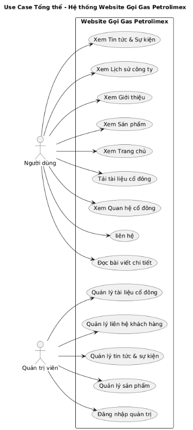
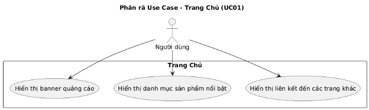
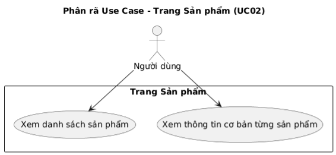
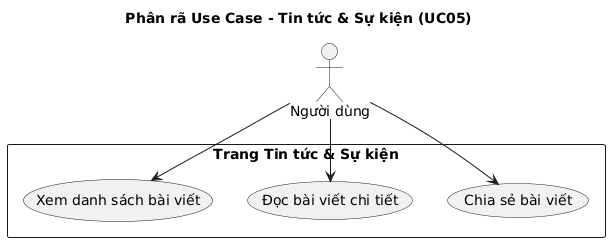
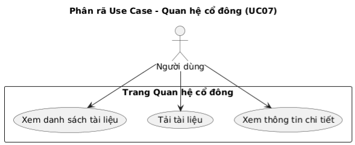

**BÁO CÁO DỰ ÁN WEBSITE GỌI GAS PETROLIMEX**

**1. GIỚI THIỆU**

**1.1. Tổng quan về dự án**

Website Gọi Gas Petrolimex là một hệ thống thông tin trực tuyến được phát triển nhằm giới thiệu và cung cấp thông tin toàn diện về các sản phẩm gas của Tổng công ty Gas Petrolimex. Đây là một nền tảng web hiện đại, thân thiện với người dùng, cho phép khách hàng và cổ đông dễ dàng tiếp cận thông tin về sản phẩm, dịch vụ cũng như các hoạt động của công ty.

**1.2. Mục tiêu dự án**

Dự án được triển khai với các mục tiêu cụ thể sau:

- Cung cấp thông tin sản phẩm: Giúp khách hàng dễ dàng tìm hiểu về các loại sản phẩm gas Petrolimex với thông tin chi tiết, hình ảnh minh họa rõ ràng.
- Tăng cường truyền thông: Cập nhật tin tức, sự kiện, hoạt động của công ty một cách nhanh chóng và kịp thời đến với công chúng.
- Xây dựng hình ảnh thương hiệu: Thể hiện lịch sử phát triển, tầm nhìn, sứ mệnh và giá trị cốt lõi của Petrolimex Gas, tạo niềm tin với khách hàng.
- Hỗ trợ quan hệ cổ đông: Cung cấp kênh tra cứu tài liệu, báo cáo tài chính và thông tin quan trọng dành cho cổ đông.
- Tối ưu trải nghiệm người dùng: Thiết kế giao diện thân thiện, dễ sử dụng trên mọi thiết bị (desktop, tablet, mobile).

**1.3. Phạm vi dự án**

Website tập trung vào các chức năng chính bao gồm:

- Hiển thị thông tin sản phẩm gas
- Quản lý và hiển thị tin tức, sự kiện
- Giới thiệu về công ty (lịch sử, tầm nhìn, sứ mệnh)
- Hỗ trợ liên hệ qua hotline
- Cung cấp thông tin và tài liệu cho cổ đông
- Hệ thống quản trị nội dung cho admin

**1.4. Đối tượng sử dụng**

- Khách hàng cá nhân: Người có nhu cầu tìm hiểu và sử dụng sản phẩm gas Petrolimex
- Ban quản trị: Đội ngũ quản lý nội dung và cập nhật thông tin website
## **2. PHÂN CHIA CÔNG VIỆC**
### **2.1. Sơ đồ phân công**

|**STT**|**Thành viên**|**Vai trò**|**Tỷ lệ đóng góp**|
| :-: | :-: | :-: | :-: |
|1|Vương Tuấn Hưng|Backend & Frontend Developer|70%|
|2|Trần Minh Ngọc|Support Developer|15%|
|3|Đặng Đức Trí|Database Administrator|15%|

**2.2. Chi tiết công việc từng thành viên**

|**Thành viên**|**Vai trò**|**Nhiệm vụ chính**|**Kết quả đạt được**|
| :-: | :-: | :-: | :-: |
|**Vương Tuấn Hưng**|Backend & Frontend Developer|**Backend:** • Cài đặt và cấu hình WordPress • Phát triển Custom Post Types: Sản phẩm, Tin tức, Tài liệu cổ đông, Lịch sử công ty • Xây dựng file functions.php, phát triển hooks & filters • Tích hợp dữ liệu, tối ưu performance, bảo mật website  **Frontend:** • Thiết kế và code 8 trang chính (Home, Products, About, History, News, Contact, Investor, Admin) • Tích hợp Bootstrap, PostCSS, JavaScript cho tương tác (menu, timeline, slider, form validation) • Tối ưu UX/UI, kiểm thử đa trình duyệt|✅ Hoàn thành 100% backend & frontend ✅ Website hoạt động ổn định, mượt mà|
|**Trần Minh Ngọc**|Support Developer|• Hỗ trợ cắt HTML từ mockup • Viết CSS/PostCSS cho components nhỏ (cards, footer, buttons, forms) • Điều chỉnh responsive, tối ưu hình ảnh • Upload media, test trên nhiều trình duyệt • Kiểm tra, báo cáo bugs, hỗ trợ viết tài liệu & upload nội dung mẫu|✅ Hỗ trợ hoàn thành 30% frontend ✅ Phát hiện và báo cáo bugs ✅ Hoàn thành testing trên trình duyệt|
|**Đặng Đức Trí**|Database Administrator|• Thiết kế cấu trúc cơ sở dữ liệu (ERD, bảng, quan hệ) • Tạo schema WordPress (wp\_posts, wp\_postmeta, wp\_terms, custom tables) • Tối ưu bằng indexes, foreign keys • Insert sample data (20+ sản phẩm, 30+ tin, 10+ tài liệu, timeline) • Quản lý DB bằng AdminNeo (backup, restore, optimization)|✅ Hoàn thành database design (15+ bảng) ✅ Dữ liệu mẫu đầy đủ và chính xác|

-----
**2.3. Quy trình làm việc nhóm**

|**Giai đoạn**|**Thời gian**|**Thành viên tham gia**|**Nhiệm vụ cụ thể**|
| :-: | :-: | :-: | :-: |
|**Giai đoạn 1: Lên kế hoạch**|Tuần 1|Cả nhóm|• Họp phân tích yêu cầu • Vẽ use case diagram • Phân công công việc chi tiết • Thiết lập môi trường development|
|**Giai đoạn 2: Thiết kế**|Tuần 2|Đặng Đức Trí, Vương Tuấn Hưng, Trần Minh Ngọc|• Trí: Thiết kế database ERD • Hưng: Thiết kế wireframe, mockup • Ngọc: Chuẩn bị assets, images|
|**Giai đoạn 3: Development**|Tuần 3–5|Cả nhóm|• Trí: Setup database, insert data • Hưng: Code backend & frontend • Ngọc: Hỗ trợ frontend, testing|
|**Giai đoạn 4: Testing & Deployment**|Tuần 6|Cả nhóm|• Kiểm thử toàn bộ chức năng • Fix bugs • Tối ưu hiệu suất • Triển khai website lên host|

**3. KIẾN TRÚC & CÔNG NGHỆ SỬ DỤNG**

**3.1. Kiến trúc hệ thống**

Website được xây dựng theo mô hình **MVC (Model-View-Controller)** trên nền tảng WordPress:

┌─────────────────────────────────────────────┐

│            PRESENTATION LAYER               │

│  (HTML, PostCSS, Bootstrap, JavaScript)     │

└─────────────────┬───────────────────────────┘

`                  `│

┌─────────────────▼───────────────────────────┐

│          APPLICATION LAYER                  │

│    (WordPress Core, PHP, Custom Themes)     │

└─────────────────┬───────────────────────────┘

`                  `│

┌─────────────────▼───────────────────────────┐

│             DATA LAYER                      │

│        (MySQL Database, AdminNeo)           │

└─────────────────────────────────────────────┘

**Luồng xử lý request:**

1. User gửi HTTP request đến server
1. WordPress routing xử lý và gọi controller tương ứng
1. Controller truy vấn database qua Model
1. Dữ liệu được xử lý và trả về View
1. View render HTML và trả về cho User

**3.2. Công nghệ sử dụng.**

|**STT**|**Công nghệ**|**Phiên bản / Loại**|**Lý do chọn**|**Chức năng / Tính năng**|
| :-: | :-: | :-: | :-: | :-: |
|1|**Content Management System**|WordPress 6.x|Dễ quản lý nội dung, cộng đồng lớn, nhiều plugin|Quản lý posts, pages, media, users|
|2|**Frontend Technologies**|HTML5|Cấu trúc semantic markup, hỗ trợ SEO, Accessibility features|Xây dựng cấu trúc trang web chuẩn, thân thiện với người dùng và công cụ tìm kiếm|
|||PostCSS|Xử lý và tối ưu CSS, Autoprefixer, minification, Variables và nesting|Tối ưu CSS, hỗ trợ cross-browser, quản lý style dễ dàng|
|||Bootstrap 5.x|Grid system responsive, Utility classes, Components, Mobile-first|Tạo layout responsive, nhanh chóng xây dựng UI với các components sẵn có|
|||JavaScript (ES6+)|Vanilla JS cho performance|DOM manipulation, Event handling, AJAX requests, Animation và transitions|
|3|**Backend Technologies**|PHP 7.4+|Ngôn ngữ server-side chính|WordPress functions và hooks, Custom post types, Template hierarchy, Data sanitization và validation|
|||WordPress REST API|Endpoint cho AJAX requests|Data interchange với JSON format|
|4|**Database**|MySQL 8.0+|Relational database management, ACID compliance, hỗ trợ complex queries|Tối ưu dữ liệu, tạo indexes, quản lý dữ liệu hiệu quả|
|||AdminNeo|Web-based database management|Visual query builder, Backup và restore, Performance monitoring|

**4. CHỨC NĂNG CHÍNH:**

**4.1 CÁC ACTOR TRONG HỆ THỐNG**

|**Actor**|**Mô tả vai trò**|
| :-: | :-: |
|**Người dùng (Khách truy cập)**|Người dùng truy cập website để xem sản phẩm, đọc tin tức, gửi liên hệ hoặc xem thông tin cổ đông.|
|**Quản trị viên (Admin)**|Quản lý nội dung website qua trang quản trị WordPress: thêm/sửa/xóa bài viết, sản phẩm, tin tức, tài liệu cổ đông, xử lý thông tin liên hệ.|

**4.2 CÁC USE CASE CHÍNH**

|**Mã**|**Tên Use Case**|**Mô tả ngắn**|
| :-: | :-: | :-: |
|UC01|Xem trang chủ|Người dùng truy cập trang chủ để xem thông tin tổng quan và các mục nổi bật.|
|UC02|Xem sản phẩm|Người dùng duyệt danh sách sản phẩm gas Petrolimex.|
|UC03|Xem trang giới thiệu|Người dùng xem thông tin về công ty, tầm nhìn, sứ mệnh.|
|UC04|Xem lịch sử|Người dùng xem lịch sử hình thành và phát triển của Petrolimex Gas.|
|UC05|Xem tin tức & sự kiện|Người dùng theo dõi các bài viết, thông báo mới.|
|UC06|Gửi liên hệ|Người dùng nhập liên hệ qua số hotline|
|UC07|Xem quan hệ cổ đông|Người dùng xem và tải về các tài liệu cổ đông.|
|UC08|Quản lý nội dung (Admin)|Quản trị viên thêm, sửa, xóa nội dung trong hệ thống.|

**4.3 ĐẶC TẢ CHI TIẾT CHỨC NĂNG**

**UC01 – Xem Trang Chủ**

- **Mô tả:** Hiển thị thông tin tổng quan, banner, sản phẩm nổi bật.
- **Tác nhân chính:** Người dùng
- **Tiền điều kiện:** Người dùng truy cập vào trang chủ.
- **Luồng chính:**
  - Người dùng mở địa chỉ website.
  - Hệ thống tải dữ liệu banner, danh mục, tin tức.
  - Hiển thị giao diện chính.
- **Kết quả:** Giao diện trang chủ hiển thị đầy đủ thông tin.
-----
**UC02 – Xem Sản Phẩm**

- **Mô tả:** Người dùng xem danh sách sản phẩm gas Petrolimex.
- **Luồng chính:**
  - Người dùng chọn “Sản phẩm”.
  - Hệ thống lấy danh sách từ cơ sở dữ liệu.
  - Hiển thị sản phẩm (ảnh, tên, mô tả ngắn).

**Kết quả:** Danh sách sản phẩm hiển thị thành công.

-----
**UC03 – Xem Giới Thiệu**

- **Mô tả:** Hiển thị thông tin giới thiệu công ty, tầm nhìn, sứ mệnh, giá trị cốt lõi.
- **Luồng chính:**
  - Người dùng chọn mục “Giới thiệu”.
  - Hệ thống tải nội dung từ CSDL.
  - Hiển thị nội dung trên trình duyệt.
- **Kết quả:** Người dùng xem được nội dung giới thiệu.
-----
**UC04 – Xem Lịch Sử**

- **Mô tả:** Cung cấp thông tin lịch sử phát triển của công ty.
- **Luồng chính:**
  - Người dùng chọn “Lịch sử”.
  - Hệ thống tải danh sách mốc thời gian.
  - Hiển thị timeline lịch sử.
- **Kết quả:** Người dùng xem được các mốc phát triển.
-----
**UC05 – Xem Tin Tức & Sự Kiện**

- **Mô tả:** Hiển thị các bài viết, tin tức, sự kiện mới.
- **Luồng chính:**
  - Người dùng chọn “Tin tức & Sự kiện”.
  - Hệ thống truy vấn và hiển thị danh sách bài viết.
  - Người dùng chọn bài viết để xem chi tiết.
- **Kết quả:** Hiển thị nội dung bài viết chi tiết.
-----
**UC06 – Gửi Liên Hệ**

- **Mô tả:** Người dùng gọi quan hotline.
- **Luồng chính:**
  - Người dùng chọn “Liên hệ”.
  - Nhấn gọi
- **Kết quả:** Gọi thành công
-----
**UC07 – Xem Quan Hệ Cổ Đông**

- **Mô tả:** Hiển thị các tài liệu, báo cáo, thông báo dành cho cổ đông.
- **Luồng chính:**
  - Người dùng chọn “Quan hệ cổ đông”.
  - Hệ thống hiển thị danh sách tài liệu.
  - Người dùng có thể tải hoặc xem trực tiếp.
- **Kết quả:** Người dùng xem hoặc tải tài liệu cổ đông.
-----
**UC08 – Quản lý nội dung (Admin)**

- **Mô tả:** Quản trị viên đăng nhập trang quản trị để cập nhật dữ liệu website.
- **Luồng chính:**
  - Admin đăng nhập trang wp-admin.
  - Chọn loại nội dung cần quản lý (sản phẩm, tin tức, liên hệ).
  - Thêm, sửa, xóa nội dung.
- **Kết quả:** Dữ liệu được cập nhật lên website.

## **5. HƯỚNG DẪN CÀI ĐẶT.**
**B1: Tạo 1 trang mới trên local WP.**

**B2: clone dự án” git clone git@github.com:TuanHung0512/Petrolimex.git . “**

**B3: import db vào amdinNeo**

**B4: Tải thư mục upload " https://drive.google.com/drive/folders/1Rg5pcWpI8nqt1bpqy6FFEKAThaPH2C4Q?usp=drive_link " rồi add vào wp-content**

**B5: Chọn opensite**

